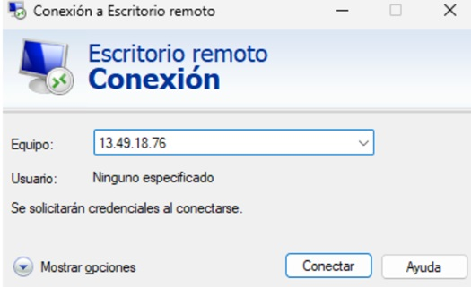

# Guía para la Creación de un Servidor Windows Server en AWS

Esta guía detalla el proceso para desplegar una instancia de Windows Server en Amazon Web Services (AWS). Siguiendo estos pasos, podrás crear tu propio servidor Windows en la nube de AWS.

## 1. Acceso a la Consola de AWS

El primer paso es acceder a la consola de administración de AWS.

1.  Abre tu navegador web y ve a la página de inicio de sesión de AWS: [https://aws.amazon.com/es/console/](https://aws.amazon.com/es/console/)
2.  Introduce tu dirección de correo electrónico o número de teléfono asociado a tu cuenta de AWS.
3.  Escribe tu contraseña y haz clic en "Iniciar sesión".
4.  Una vez autenticado, llegarás al panel de control de la consola de AWS.

 

## 2. Navegación al Servicio EC2

Amazon Elastic Compute Cloud (EC2) es el servicio que te permite crear y administrar máquinas virtuales en la nube.

1.  En la barra de búsqueda de la consola, escribe "EC2" y selecciónalo de los resultados.
2.  Alternativamente, puedes encontrar "EC2" en la sección de "Servicios" bajo la categoría de "Computación".
3.  Serás redirigido al panel de control de EC2.

   

## 3. Lanzamiento de una Nueva Instancia

Para crear tu servidor Windows Server, necesitas lanzar una nueva instancia EC2.

1.  En el panel de control de EC2, haz clic en el botón "Lanzar instancia".

    

## 4. Selección de la Amazon Machine Image (AMI)

Una AMI es una imagen preconfigurada que proporciona la información necesaria para lanzar una instancia. Seleccionaremos una AMI de Windows Server.

1.  En la página de selección de AMI, busca en la barra de búsqueda "Windows Server".
2.  Verás varias opciones. Elige la AMI que se ajuste a tus necesidades (por ejemplo, "Microsoft Windows Server 2022 Base"). Asegúrate de que sea elegible para la capa gratuita si estás dentro del periodo de prueba.
3.  Haz clic en el botón "Seleccionar" junto a la AMI deseada.

    

## 5. Selección del Tipo de Instancia

El tipo de instancia determina los recursos de hardware de tu servidor (CPU, memoria, etc.).

1.  Se te presentará una lista de tipos de instancia. Elige un tipo que se ajuste a tus necesidades de rendimiento y presupuesto. Para pruebas, un tipo `t3.micro` (si está disponible en tu región y es elegible para la capa gratuita) es suficiente.
2.  Haz clic en el botón "Siguiente: Configurar detalles de instancia".

    

## 6. Configuración de los Detalles de la Instancia

En esta sección, configurarás varios aspectos de tu instancia, como la red, la subred, el rol de IAM, etc. Para una configuración básica, puedes dejar la mayoría de las opciones con sus valores predeterminados.

1.  **Red:** Puedes elegir la VPC (Virtual Private Cloud) por defecto o crear una nueva.
2.  **Subred:** Elige una subred dentro de la VPC.
3.  **Asignar automáticamente IP pública:** Asegúrate de que esté habilitado ("Activar") si deseas acceder a tu servidor directamente desde internet.
4.  Revisa las demás opciones y configúralas según tus necesidades.
5.  Haz clic en el botón "Siguiente: Añadir almacenamiento".

    

## 7. Añadir Almacenamiento(Opcional)

Aquí configurarás el volumen de almacenamiento raíz para tu instancia.

1.  Puedes modificar el tamaño del volumen (en GB) y el tipo de volumen (SSD de propósito general - gp2/gp3 recomendado para la mayoría de los casos).
2.  Puedes añadir volúmenes adicionales si es necesario.
3.  Haz clic en el botón "Siguiente: Añadir etiquetas".

    
## 8. Añadir Etiquetas (Opcional)

Las etiquetas son pares clave-valor que te ayudan a organizar y administrar tus recursos de AWS.

1.  Haz clic en "Añadir etiqueta".
2.  Introduce un nombre para la etiqueta (por ejemplo, "Nombre") y un valor (por ejemplo, "MiServidorWindows").
3.  Puedes añadir más etiquetas si lo deseas.
4.  Haz clic en el botón "Siguiente: Configurar grupo de seguridad".

## 9. Configurar Grupo de Seguridad

Un grupo de seguridad actúa como un firewall virtual para tu instancia, controlando el tráfico entrante y saliente.

1.  Puedes seleccionar un grupo de seguridad existente o crear uno nuevo. Recomendamos crear un nuevo grupo de seguridad para tu servidor Windows.
2.  Haz clic en "Añadir regla".
3.  Configura las siguientes reglas esenciales:
    * **Tipo:** RDP (Protocolo de escritorio remoto)
        * **Origen:** "Mi IP" (para permitir la conexión solo desde tu dirección IP actual por seguridad) o "Cualquier origen" (0.0.0.0/0 - menos seguro, usar con precaución).
4.  Revisa las reglas configuradas.
5.  Haz clic en el botón "Revisar y lanzar".

    

## 10. Generación y Uso del Par de Claves

Antes de que se lance tu instancia, se te pedirá que configures un par de claves (clave privada y clave pública). La clave privada te permitirá conectarte de forma segura a tu instancia mediante Escritorio Remoto (RDP) utilizando la contraseña inicial.

1.  En la ventana emergente, selecciona "Crear un nuevo par de claves".
2.  Introduce un nombre descriptivo para tu par de claves (por ejemplo, "MiClaveWindows").
3.  Haz clic en el botón "Descargar par de claves". **Guarda este archivo `.pem` en un lugar seguro de tu ordenador. No podrás descargarlo de nuevo.**
4.  Marca la casilla de confirmación y haz clic en el botón "Lanzar instancias".

5.  Verás una página de confirmación indicando que tus instancias se están lanzando. Haz clic en el enlace "Ver instancias" para ir al panel de control de EC2.

    

## 11. Obtención de la IP Pública

Una vez que la instancia esté en estado "En ejecución", podrás obtener su dirección IP pública.

1.  En el panel de control de EC2, selecciona la instancia que acabas de crear.
2.  En la pestaña "Detalles" de la instancia, busca el campo "IPv4 pública". Anota esta dirección IP.

   Este paso se me paso la captura per la ip publica ya que reinicie el servidor era la 13.49.18.76
   

## 12. Obtención de la Contraseña de Windows

Para conectarte a tu servidor Windows mediante Escritorio Remoto, necesitarás la contraseña inicial. Esta se descifra utilizando la clave privada que descargaste.

1.  Con la instancia seleccionada, haz clic en el botón "Conectar".
2.  Selecciona la opción "RDP client".
3.  Haz clic en el botón "Obtener contraseña".
4.  Se abrirá una nueva ventana. Haz clic en el botón "Seleccionar archivo" y carga el archivo `.pem` de tu par de claves que descargaste anteriormente.
5.  Haz clic en el botón "Descifrar contraseña".
6.  Se mostrará la contraseña de administrador. **Cópiala y guárdala en un lugar seguro.**

    

## 13. Conexión mediante Escritorio Remoto

Ahora puedes conectarte a tu servidor Windows Server utilizando la aplicación Escritorio Remoto (o Remote Desktop Connection) de tu sistema operativo.

1.  Abre la aplicación Escritorio Remoto en tu ordenador.
2.  En el campo "Equipo", introduce la dirección IP pública de tu instancia de AWS.
3.  Haz clic en "Conectar".
4.  Si se te advierte sobre el certificado, puedes aceptarlo y continuar.
5.  Se te pedirá un nombre de usuario y una contraseña. El nombre de usuario predeterminado es "Administrator". Introduce la contraseña que descifraste en el paso anterior.
6.  Haz clic en "Aceptar".

    

7.  ¡Felicidades! Ahora estás conectado a tu servidor Windows Server en AWS.

    

